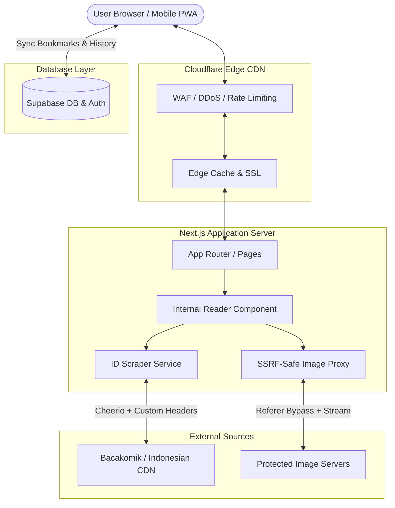

# Product Requirements Document (PRD) — ZqynToon

**Version:** 2.0.0  
**Status:** Approved for Implementation  
**Target Platform:** Web (Desktop, Tablet, Mobile PWA-Ready)  
**Production URL:** `https://zynqtoon.vercel.app`  
**Primary Focus:** 100% Platform Baca Komik Bahasa Indonesia (Manga, Manhwa, Manhua) — Anti-Slop, High-Performance, Internal Reader.

---

## 1. Executive Summary & Vision

### 1.1 The Problem
Mayoritas situs baca komik Bahasa Indonesia saat ini memiliki masalah fatal:
1. **Penuh Iklan & Redirect Agresif:** Pengguna sering dialihkan ke situs judi/iklan atau dilempar ke situs eksternal saat ingin membaca chapter.
2. **AI-Slop & Desain Usang:** Template kloningan generic tahun 2015 dengan layout berantakan, font tidak terbaca, dan minim estetika.
3. **Core Web Vitals Hancur:** Skor PageSpeed mobile sering di bawah 40 akibat CLS tinggi dari banner iklan, render-blocking scripts, dan gambar tanpa dimensi.
4. **Error 403 Forbidden:** Hotlinking gambar sering mati karena CDN scanlation memblokir referer tanpa mekanisme proxy yang tangguh.

### 1.2 The Solution: ZqynToon
ZqynToon adalah platform baca komik modern berstandar editorial premium yang dirancang khusus untuk pembaca komik Indonesia:
- **100% Pembacaan Internal:** Tidak pernah melempar pengguna ke situs eksternal. Semua chapter dan gambar dirender langsung di dalam internal reader ZqynToon.
- **Anti-Slop Craftsmanship:** Terinspirasi dari blueprint desain modern (`Prompt 1.webp` s/d `8.webp`) — tipografi tajam, palet obsidian gelap elegan, micro-interactions halus, dan tata letak editorial.
- **Ultra-Fast & Zero-CLS:** Memanfaatkan Next.js 16+ Turbopack, ISR/SSR caching, Cloudflare Edge, dan gambar teroptimasi dengan rasio presisi.
- **Anti-Hotlink Proxy Cerdas:** Proxy server-side yang aman dari SSRF untuk membypass proteksi referer CDN komik Indonesia secara instan tanpa error 403.
- **SEO & GSO Native:** Metadata lengkap, OpenGraph, JSON-LD schema, dynamic sitemap, dan `llms.txt` untuk optimasi search engine konvensional dan AI agent (Perplexity, ChatGPT, Claude).

---

## 2. Design DNA & Visual Blueprint (`Prompt 1.webp` – `8.webp`)

### 2.1 Aesthetic Foundation
- **Design Philosophy:** *Obsidian Cinematic Editorial*. Mengutamakan konten komik dengan latar belakang gelap pekat tanpa distraksi, dipadukan dengan aksen neon tangerine yang memberikan energi dinamis.
- **Color Palette:**
  - `Background Deep`: `#07080B` (Base body)
  - `Surface Dark`: `#0F1117` (Cards, drawers, modals)
  - `Surface Elevated`: `#171A23` (Dropdowns, floating toolbars)
  - `Border / Divider`: `rgba(255, 255, 255, 0.08)`
  - `Accent Tangerine`: `#F27D26` (Primary CTA, active states, progress bar)
  - `Accent Glow`: `rgba(242, 125, 38, 0.25)`
  - `Text Primary`: `#F3F4F6`
  - `Text Muted`: `#9CA3AF`
- **Typography:**
  - Display / Hero: `Syne` / `Cinzel` / `Plus Jakarta Sans` (Bold, Modern Editorial)
  - Body & UI: `Plus Jakarta Sans` / `Inter` (Legible, crisp rendering di layar mobile retina)

### 2.2 Layout Blueprint Breakdown
Berdasarkan analisis visual aset referensi `1.webp` – `8.webp`:

1. **Cover & Hero Spotlight (`1.webp` - `2.webp`):**
   - Backdrop blur sinematik dengan gradient fade ke `#07080B`.
   - Grid thumbnail dengan aspect ratio 3:4, rounded-xl, subtle border highlight saat hover.
   - Badge status: *Hot*, *Colored*, *Ongoing*, *Chapter Baru* dengan badge pill semi-transparan.
   - Detail komik: Metadata rapi (Author, Artist, Status, Genres, Sinopsis expand/collapse, Rating).

2. **Dedicated Internal Chapter Reader (`3.webp` - `8.webp`):**
   - **Floating Header (Auto-hide on scroll down, reveal on scroll up / tap):**
     - Tombol Back ke Detail Komik.
     - Judul Komik & Nomor Chapter aktif.
     - Quick Chapter Selector (Dropdown jump chapter).
     - Indikator halaman/progress (e.g. `Gambar 14 / 45` atau persentase).
     - Tombol Navigasi Chapter Cepat (Previous & Next Chapter).
   - **Reading Canvas:**
     - **Mode 1: Webtoon Continuous Scroll (Default):** Gambar tersusun vertikal dari atas ke bawah tanpa celah (gapless), lazy loaded dengan placeholder skeleton.
     - **Mode 2: Paged Reader (Single / Double page):** Navigasi klik kanan/kiri atau swipe gesture di mobile.
     - Fitur Fit Mode: Fit to Width, Fit to Original, Invert/Dark Filter (optional).
   - **Floating Bottom Bar / Dock:**
     - Slider progress baca instan.
     - Tombol Bookmark Chapter ini.
     - Tombol Settings Reader (ubah mode scroll/paged, lebar bacaan 600px/800px/1000px/100%).
     - Tombol Next Chapter berukuran besar di akhir halaman komik.

---

## 3. Architecture & Tech Stack

### 3.1 Core Stack
- **Framework:** Next.js 16+ (App Router, Turbopack)
- **Language:** TypeScript 5+ (Strict Mode)
- **Styling:** Tailwind CSS v4, Lucide React (Icons)
- **State Management:** Zustand v5 (Persisted reader settings, history, offline bookmarks)
- **Database & Cloud Auth:** Supabase (`@supabase/supabase-js`, `@supabase/ssr`)
- **Scraper & Parsing:** Cheerio, native Fetch dengan custom header rotation & resilient fallback
- **Performance & Auditing:** Google PageSpeed Insights API (configured via `PAGESPEED_API_KEY`)
- **Edge & CDN:** Cloudflare Edge DNS, Caching, and Security Headers

### 3.2 System Architecture Diagram



---

## 4. Functional Requirements

### 4.1 Indonesian Comic Catalog & Scraper Engine
- **Target Sumber:** Parser komik Bahasa Indonesia aktif dan stabil (Bacakomik `bacakomik.my` sebagai engine utama).
- **Katalog:**
  - Latest Releases (Chapter terbaru yang rilis).
  - Trending / Popular (Manga, Manhwa, Manhua paling banyak dibaca).
  - Search (Pencarian judul komik instan dengan debounce 300ms).
  - Genre Filter (Action, Romance, Fantasy, Isekai, Martial Arts, Sci-Fi, dll.).
- **Komik Detail Parser:**
  - Judul, Alternative Title, Cover Image, Sinopsis, Genre list, Tipe (Manga/Manhwa/Manhua), Status (Ongoing/Completed).
  - Chapter List: Urutan dari chapter terbaru hingga chapter pertama, nomor chapter, tanggal rilis, dan slug unik.

### 4.2 100% Internal Reader (Strictly NO External Redirects)
- **Aturan Mutlak:** TIDAK BOLEH ada link eksternal yang melempar user ke situs lain seperti MangaPlus atau website scam.
- **Parsing Gambar Chapter:**
  - Ambil seluruh URL gambar chapter langsung dari markup container komik (`#chimg-thumbs`, `.reader-area`, dll.).
  - Jika gambar menggunakan lazy-loading attributes (`data-src`, `data-lazy-src`), scraper otomatis mengekstrak URL aslinya.
- **Anti-Hotlink Image Proxy (`/api/proxy`):**
  - Mengalirkan (stream) gambar komik ke browser user dengan menyuntikkan header yang tepat:
    - `Referer: https://bacakomik.my/`
    - `User-Agent: Mozilla/5.0 (Windows NT 10.0; Win64; x64) AppleWebKit/537.36...`
  - Proteksi SSRF (Server-Side Request Forgery):
    - Validasi whitelist domain (hanya menerima domain gambar komik terdaftar: `*.wp.com`, `*.lol`, `*.lat`, `*.pics`, `*.bacakomik.*`).
    - Tolak request ke private IP (`127.0.0.1`, `10.*`, `192.168.*`, `169.254.*`, `localhost`).
  - Cache Control: `public, max-age=86400, s-maxage=604800, stale-while-revalidate=86400` untuk mengurangi beban server.

### 4.3 Navigasi Chapter & Pengalaman Membaca
- **Next & Previous Chapter Handling:**
  - Halaman reader mengetahui chapter sebelum dan sesudahnya secara akurat.
  - Terdapat tombol besar di bagian bawah: "Lanjut Chapter Selanjutnya" dan "Kembali ke Chapter Sebelumnya".
  - Dropdown selector berisi seluruh daftar chapter komik tersebut untuk loncat instan.
- **Keyboard Shortcuts (Desktop):**
  - `Arrow Left` / `A`: Halaman/Chapter sebelumnya.
  - `Arrow Right` / `D`: Halaman/Chapter selanjutnya.
  - `F`: Toggle Fullscreen mode.
  - `M`: Toggle Menu / Header bar.
- **Mobile Touch Gestures:**
  - Tap di area tengah untuk memunculkan/menyembunyikan bar navigasi.
  - Double tap untuk zoom.

### 4.4 Bookmarks & Reading History
- **Dual-Layer Storage:**
  1. **Guest / Anonymous:** Tersimpan di browser `localStorage` via Zustand persist (bisa langsung digunakan tanpa login).
  2. **Authenticated User:** Sinkronisasi otomatis ke Supabase database (`bookmarks` dan `reading_history`).
- **Data yang Disimpan:**
  - Komik ID / Slug, Judul, Cover, Last Read Chapter ID, Tanggal Terakhir Dibaca, Persentase Progress.

---

## 5. Non-Functional Requirements & Performance

### 5.1 Core Web Vitals & PageSpeed Insights API
- **Target Score:**
  - Mobile: **≥ 90**
  - Desktop: **≥ 95**
- **Metrik Kunci:**
  - **LCP (Largest Contentful Paint):** < 2.5s (Preload hero image / cover, priority loading untuk chapter cover).
  - **INP (Interaction to Next Paint):** < 200ms (Zustand client state tanpa hydration lag).
  - **CLS (Cumulative Layout Shift):** < 0.1 (Aspek rasio container gambar selalu didefinisikan dengan skeleton placeholder sebelum load).
- **Verifikasi Otomatis:**
  - Script audit PageSpeed (`scripts/audit-pagespeed.mjs`) terintegrasi dengan Google PageSpeed Insights API via `PAGESPEED_API_KEY`.
    - Target audit: URL Vercel production dan local preview.

### 5.2 Cloudflare & Edge Optimization
- **Security Headers:**
  - `Content-Security-Policy` (CSP) ketat — no inline evil scripts.
  - `X-Frame-Options: DENY` (Anti-clickjacking).
  - `X-Content-Type-Options: nosniff`.
  - `Referrer-Policy: strict-origin-when-cross-origin`.
- **Edge Caching Rules:**
  - Static images (`/api/proxy`): Cache TTL 7 hari di Edge.
  - Manga Detail & List: S-MaxAge 600 detik (10 menit) dengan stale-while-revalidate.

### 5.3 SEO & Generative Search Optimization (GSO)
- **Semantic HTML5:** `<header>`, `<nav>`, `<main>`, `<article>`, `<section>`, `<footer>`.
- **OpenGraph & Twitter Card:** Title dinamis, deskripsi sinopsis komik, cover image HD untuk preview WhatsApp, X/Twitter, Telegram.
- **Structured Data (Schema.org JSON-LD):**
  - `WebSite` dengan SearchAction.
  - `ComicSeries` untuk halaman detail komik.
  - `ComicIssue` untuk halaman chapter baca.
  - `BreadcrumbList` untuk struktur hierarki navigasi.
- **AI Agent Discovery (`public/llms.txt`):**
  - Dokumentasi ringkas terstruktur untuk crawler LLM/AI (Claude, Perplexity, GPT) yang menjelaskan struktur URL dan konten ZqynToon.
- **Sitemap & Robots:**
  - `sitemap.xml` dinamis dengan update frekuensi tinggi.
  - `robots.txt` ramah crawler mesin pencari.

---

## 6. Database Schema (Supabase)

```sql
-- Profiles table
CREATE TABLE IF NOT EXISTS public.profiles (
  id UUID REFERENCES auth.users(id) ON DELETE CASCADE PRIMARY KEY,
  email TEXT,
  username TEXT,
  avatar_url TEXT,
  created_at TIMESTAMPTZ DEFAULT NOW(),
  updated_at TIMESTAMPTZ DEFAULT NOW()
);

-- Bookmarks table
CREATE TABLE IF NOT EXISTS public.bookmarks (
  id UUID DEFAULT gen_random_uuid() PRIMARY KEY,
  user_id UUID REFERENCES public.profiles(id) ON DELETE CASCADE NOT NULL,
  comic_slug TEXT NOT NULL,
  comic_title TEXT NOT NULL,
  cover_url TEXT NOT NULL,
  comic_type TEXT DEFAULT 'Manga',
  created_at TIMESTAMPTZ DEFAULT NOW(),
  UNIQUE(user_id, comic_slug)
);

-- Reading History table
CREATE TABLE IF NOT EXISTS public.reading_history (
  id UUID DEFAULT gen_random_uuid() PRIMARY KEY,
  user_id UUID REFERENCES public.profiles(id) ON DELETE CASCADE NOT NULL,
  comic_slug TEXT NOT NULL,
  comic_title TEXT NOT NULL,
  cover_url TEXT NOT NULL,
  chapter_id TEXT NOT NULL,
  chapter_title TEXT NOT NULL,
  progress NUMERIC DEFAULT 0,
  updated_at TIMESTAMPTZ DEFAULT NOW(),
  UNIQUE(user_id, comic_slug)
);

-- RLS Policies
ALTER TABLE public.profiles ENABLE ROW LEVEL SECURITY;
ALTER TABLE public.bookmarks ENABLE ROW LEVEL SECURITY;
ALTER TABLE public.reading_history ENABLE ROW LEVEL SECURITY;

CREATE POLICY "Users can manage own profile" ON public.profiles FOR ALL USING (auth.uid() = id);
CREATE POLICY "Users can manage own bookmarks" ON public.bookmarks FOR ALL USING (auth.uid() = user_id);
CREATE POLICY "Users can manage own history" ON public.reading_history FOR ALL USING (auth.uid() = user_id);
```

---

## 7. Implementation Roadmap & Verification Gates

### Phase 1: Foundation & Scraper Engine
- Setup project Next.js 16+, TypeScript, Tailwind CSS v4, Lucide React.
- Implementasi SSRF-safe `/api/proxy` route untuk bypass 403 CDN gambar komik Indonesia.
- Implementasi API scraper Bahasa Indonesia teruji (`/api/id-scraper/latest`, `/api/id-scraper/detail`, `/api/id-scraper/chapters`, `/api/id-scraper/pages`, `/api/id-scraper/search`).
- **Verification Gate 1:**
  - Test skrip Node.js memastikan scraper sukses mengambil data judul komik (contoh: One Piece, Solo Leveling, Jujutsu Kaisen).
  - Test proxy gambar mengembalikan HTTP 200 OK dengan content-type image/jpeg atau image/webp.

### Phase 2: Design System & Core Pages
- Setup design system token (Obsidian `#07080B`, Tangerine `#F27D26`, tipografi).
- Implementasi Layout utama: Navbar responsif, Search modal, Footer editorial.
- Implementasi Homepage (`/`): Spotlight Hero, Latest Updates grid, Trending tab, Genre pills.
- Implementasi Comic Detail (`/manga/[slug]`): Hero blur, badges, metadata, sinopsis, list chapter lengkap dengan filter & search.
- **Verification Gate 2:**
  - Build lulus tanpa TypeScript / ESLint error.
  - Desain identik dengan blueprint `1.webp` dan `2.webp`.

### Phase 3: The 100% Internal Reader
- Implementasi Halaman Reader (`/manga/[slug]/chapter-[id]`):
  - Zero external redirects.
  - Floating auto-hiding top bar (Judul, Chapter Dropdown, Prev/Next buttons).
  - Webtoon continuous scroll canvas (gapless, responsive width control).
  - Paged mode toggle.
  - Bottom chapter jump dock & next chapter big card banner.
  - Keyboard shortcuts (`←`, `→`, `F`).
- **Verification Gate 3:**
  - Uji baca chapter komik Indonesia end-to-end. Pastikan seluruh lembar gambar ter-render sempurna tanpa broken images dan navigasi chapter sebelumnya/selanjutnya berfungsi mulus.

### Phase 4: State Management, Supabase, & PWA
- Zustand stores: `readerStore` (fit mode, brightness, reader mode), `bookmarkStore`, `historyStore`.
- Supabase integration: Auth modal (login/signup), background sync bookmark & history.
- Offline-ready localStorage fallback untuk guest users.
- **Verification Gate 4:**
  - Simpan bookmark saat offline, pastikan tersimpan di UI.
  - Riwayat baca mencatat chapter terakhir yang dibuka.

### Phase 5: SEO, GSO, Cloudflare & PageSpeed Audit
- Setup dynamic `sitemap.ts`, `robots.ts`, OpenGraph metadata, JSON-LD Schema.
- Pembuatan file `public/llms.txt`.
- Konfigurasi HTTP security headers dan cache-control.
- Audit menggunakan `scripts/audit-pagespeed.mjs` dengan Google PageSpeed Insights API.
- **Verification Gate 5:**
  - Skor Google PageSpeed Insights ≥ 90.
  - Rich snippet test valid untuk JSON-LD.

---

## 8. Preserved Secrets & Environment Variables

> [!IMPORTANT]
> Seluruh kunci API sensitif dan kredensial cloud disimpan secara aman di environment variables lokal (`.env.local`) serta diatur langsung pada Vercel Dashboard / Edge Environment. Tidak ada kunci rahasia yang disimpan secara plaintext di repositori publik.

| Variable | Description | Usage |
|---|---|---|
| `PAGESPEED_API_KEY` | Terdaftar di `.env.local` / Vercel Environment | Google PageSpeed Insights API Audit |
| `NEXT_PUBLIC_SITE_URL` | `https://zynqtoon.vercel.app` | Canonical URL, SEO, OpenGraph |
| `NEXT_PUBLIC_SUPABASE_URL` | Instance Supabase Project | Supabase Cloud Instance |
| `NEXT_PUBLIC_SUPABASE_ANON_KEY` | Terdaftar di `.env.local` / Vercel Environment | Client-side Supabase Auth & Sync |

---

*PRD ini telah diselaraskan dengan instruksi user, standar anti-AI slop, blueprint `Prompt 1.webp` s/d `8.webp`, dan siap dijadikan panduan implementasi komprehensif.*
